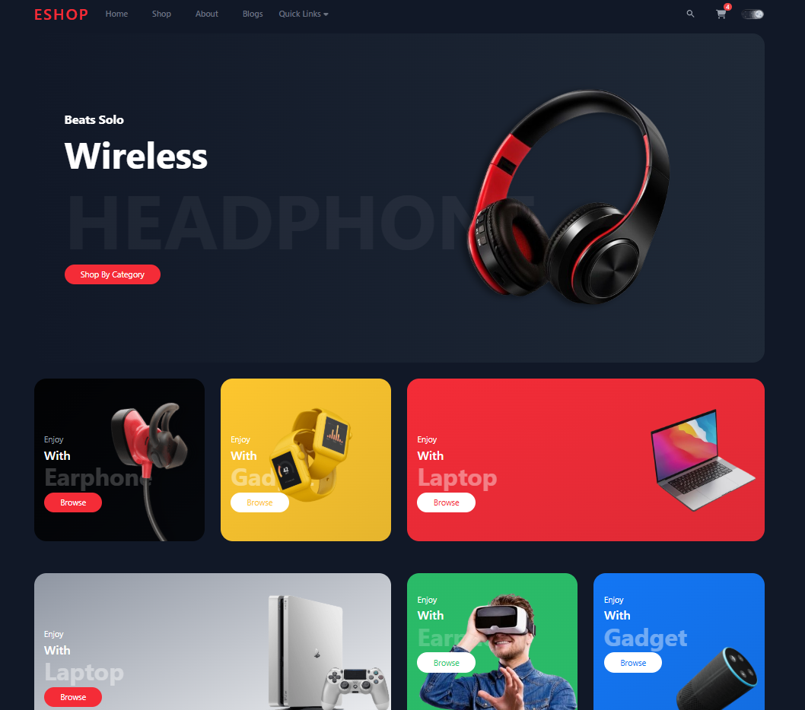

# Eshop - Ecommerce Moderno

Este projeto é um site de ecommerce desenvolvido com React e Vite, utilizando TailwindCSS para estilização. O objetivo é apresentar um layout moderno, responsivo e atrativo para lojas virtuais, destacando categorias de produtos, navegação intuitiva e modo escuro.

## Funcionalidades

- **Página inicial com destaque para produtos**
- **Categorias organizadas e visualmente atraentes**
- **Barra de navegação com links rápidos**
- **Modo claro/escuro**
- **Design responsivo**
- **Carrossel de produtos em destaque**

## Tecnologias Utilizadas

- [React](https://react.dev/)
- [Vite](https://vitejs.dev/)
- [TailwindCSS](https://tailwindcss.com/)
- [React Slick](https://react-slick.neostack.com/)
- [React Icons](https://react-icons.github.io/react-icons/)

## Como rodar o projeto

1. Clone o repositório:
   ```sh
   git clone https://github.com/seu-usuario/seu-repositorio.git
   ```
2. Instale as dependências:
   ```sh
   cd frontend
   npm install
   ```
3. Inicie o servidor de desenvolvimento:
   ```sh
   npm run dev
   ```
4. Acesse `http://localhost:5173` no navegador.

## Estrutura de Pastas

```
frontend/
  ├── src/
  │   ├── components/
  │   ├── assets/
  │   ├── App.jsx
  │   └── main.jsx
  ├── public/
  ├── index.html
  └── package.json
```

## Demonstração



## Autor

Desenvolvido por Dara Soares.

---

Este projeto é apenas para fins de portfólio e demonstração.
